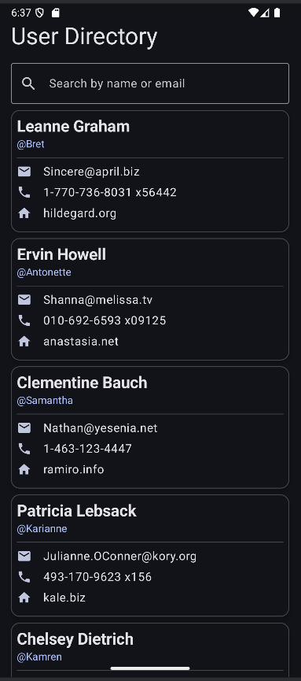
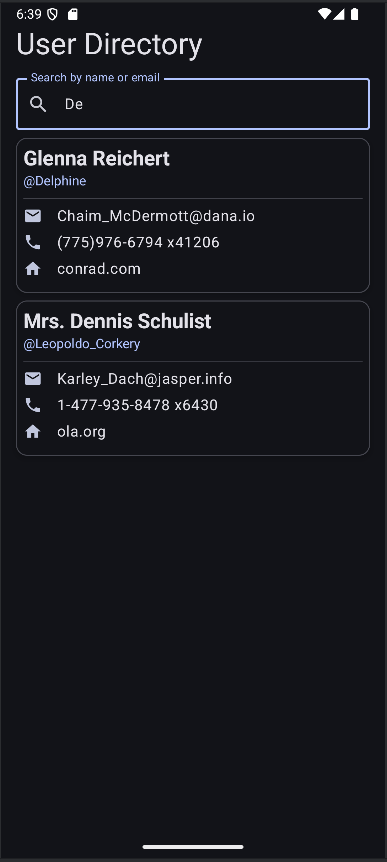

# CPSC 411A Mini Project 2: User Directory
This is a searchable user-directory frontend for Android using Jetpack Compose with the Room library
and view models to cache data between sessions. This uses Retrofit to make an HTTP GET call to
https://jsonplaceholder.typicode.com/users, but could be modified to make a GET call to any API. 
This application is using Flow to inform the UI when a database update occurs, a data access object 
to define how the Room database can be accessed, and a repository between the database and the UI.

